# QATALYST User Manual

Version: 1.3.0  
Last updated: June 1, 2026

This manual is for day-to-day users of QATALYST (QRES), including staff who manage programs, imports, reports, and monitoring, plus participants who submit evaluations.

## 1. Accessing the System

1. Open the system URL in your browser (for example, your division's hosted link).
2. If you see the landing page, click Sign In.
3. Enter your registered email and password.
4. If two-factor authentication is enabled on your account, enter the verification code sent to your email.

Related pages:
- index.html
- login.html
- verify-2fa.html
- forgot-password.html

## 2. Roles and Permissions

What you can see in the sidebar and what actions are available depend on your role and assigned permissions.

Common permissions include:
- dashboard
- programs
- certificates
- speakers
- checklist
- school_submissions
- directory
- users
- settings
- audit_logs

If a page is hidden or redirects you, request access from an administrator.

## 3. Main Navigation

After sign-in, use the sidebar to open modules.

Primary modules:
- Dashboard
- Programs / Workshops
- Speaker Roster
- Certificates (Generator and Splitter)
- Checklist
- School Submissions (All Documents Submitted)
- Directory
- Settings
- Audit Logs
- User Management
- User Manual
Primary modules:
- Dashboard
- Programs / Workshops
- Program Summary
- Speaker Roster
- Certificates (Generator and Splitter)
- Checklist
- School Submissions (All Documents Submitted)
- QR Generator
- Directory
- Settings
- Audit Logs
- User Management
- User Manual

## 4. Dashboard Quick Use

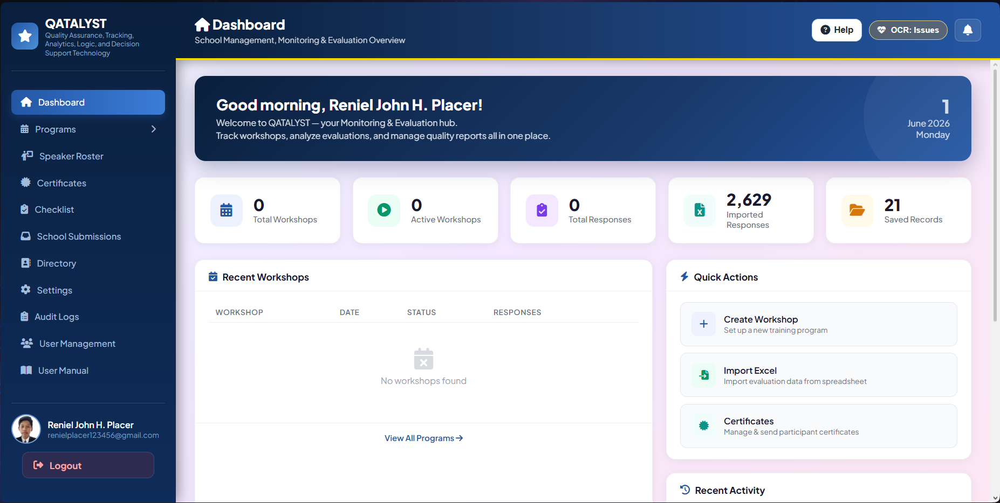

On the dashboard, you can:
- See totals for workshops, active workshops, responses, imports, and records.
- Open quick actions such as Add New Program and Import Excel.
- View recent workshops and jump to full program management.
- Use the notification bell for new evaluation submissions, school calendar submissions, and directory updates.

Related page:
- dashboard.html

## 5. Notifications

The notification bell shows recent activity that may need your attention.

How to use it:
1. Click the bell icon in the page header.
2. Click a notification item to open the related page.
3. Use Mark all as read to clear unread indicators.

Types of notifications you may see:
- Evaluation submission: opens Programs and highlights the participant in the Responses list.
- School calendar submission: opens School Submissions (All Documents Submitted) to the selected record.
- Directory update: opens Directory so you can review changes.

Each item shows a short message and a relative time (for example, 2 mins ago).

## 6. Programs and Workshops Workflow

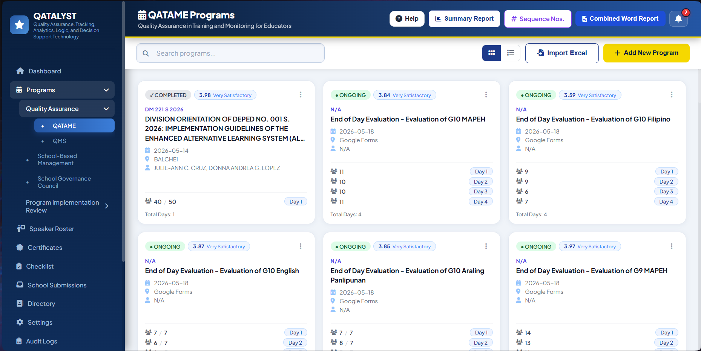

Related page:
- qatame.html (QATAME programs)
- qms.html, sbm.html, sgc.html, sdopir.html, spir.html (other program pages)

### Layout toggle

The programs list can be viewed as a card grid or a table. Use the layout toggle buttons at the top right of the list to switch between them. Your preference is saved between sessions.

### Search

Use the search bar to filter programs by title, division memo, venue, or proponents. The list updates in real time.

### A. Create a new program (container)

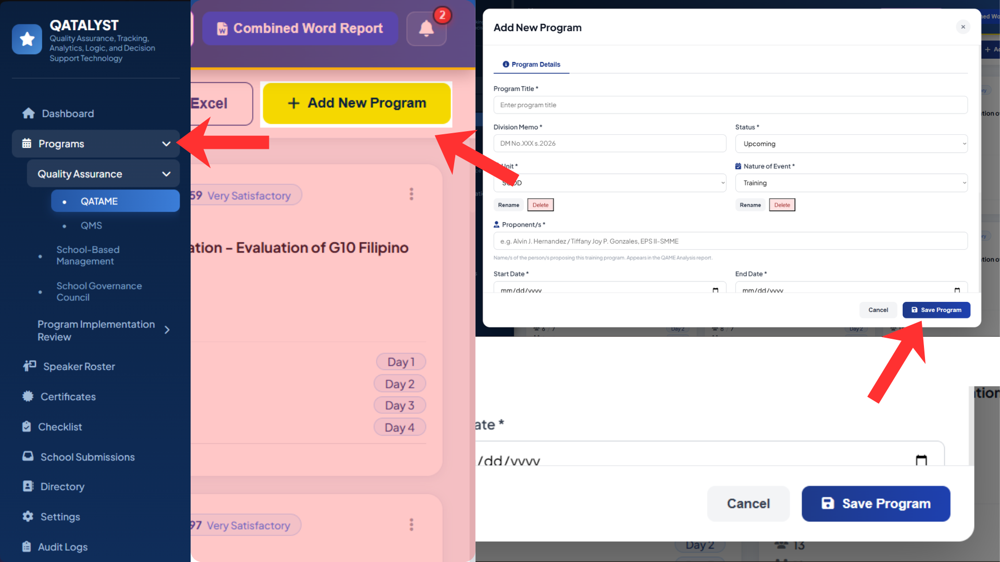

1. Open Programs / Workshops.
2. Click Add New Program.
3. Fill required fields:
   - Program title
   - Division memo
   - Status
   - Unit (select from the list or type a new value using "+ Add new...")
   - Nature of event (select from the list or type a new value using "+ Add new...")
   - Proponent/s
   - Start and end dates
   - Venue
   - Total participants (optional)
   - Description (optional)
4. Click Save Program.

Notes:
- New programs are always created as container programs. A container program links one or more day-based Excel imports (Day 1, Day 2, etc.) instead of collecting evaluations through a live form.
- The Unit and Nature of Event dropdowns are populated from the database. You can add a custom value by selecting "+ Add new…", rename a saved option using the rename button beside the dropdown, or delete one using the delete button.
- When a sequence number is entered in the edit form for a record, the system validates the format (SDOCB-SMME-YYYY-NNN) and checks for duplicates in real time.

After saving (linking day imports):
1. After the program is saved, a banner appears offering to add a Day Import. Click Add Day Import.
2. You will be redirected to Import Excel with the correct program and day label pre-filled.
3. Upload the Excel file for that day and complete the import workflow.
4. Repeat for additional days. The system automatically assigns the next available day number (Day 1, Day 2, etc.), even if a day was deleted and re-added.

Maintaining day imports (from the View modal):
- Each linked import shows its day label, source filename, response count, average score, and an editable Inclusive Dates field.
- Save Date saves the inclusive dates for a specific import immediately, without closing the modal.
- Replace navigates to Import Excel to re-import corrected data for the same day label, automatically replacing the old link.
- The trash icon removes the link between the import and the container program. The underlying imported data is not deleted.
- Add Day Import (inside the modal) adds another import to the same container.

### B. Viewing a program

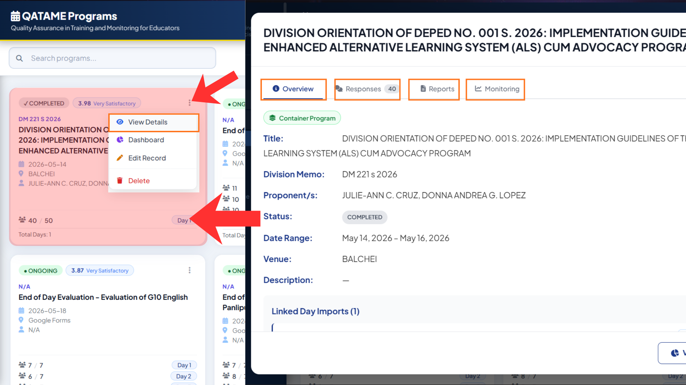

Click View Details (eye icon) or click the card body to open the program view modal. The modal has four tabs: Overview, Responses, Reports, and Monitoring.

The Overview tab shows program details, category averages, and (for container programs) the list of linked day imports. Category averages load in the background after the modal opens.

For container programs with no imports yet, the Overview tab shows a prompt to add the first import.

### C. Dropdown option management (Unit and Nature of Event)

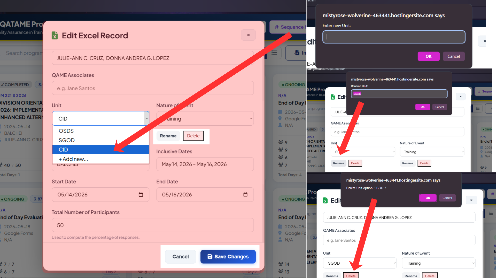

These dropdown values are shared across programs. To manage them:
- Select a value and click the Rename button beside the dropdown to rename it across all existing programs.
- Select a value and click the Delete button to remove it. Deletion is only allowed if the option exists in the database.
- Selecting "+ Add new…" opens a prompt. If you type an existing value, that value is selected instead of creating a duplicate.

### D. Program source types

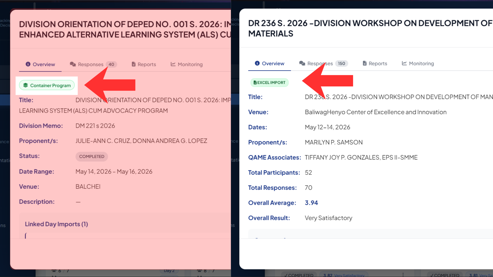

Programs in the list are displayed with a source badge:
- Container — a program that links one or more Excel day imports.
- Excel — a standalone Excel import that was not linked to a container.

### E. Editing a program

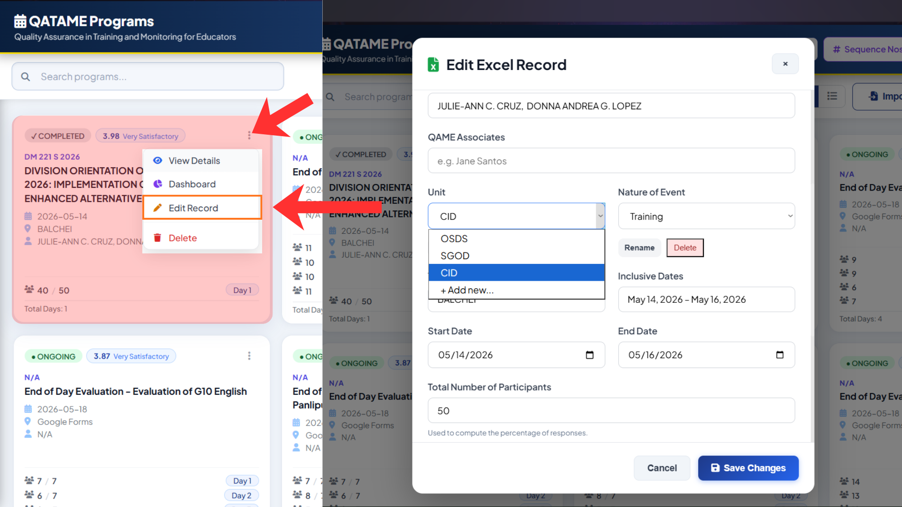

Click Edit (pencil icon) on a system/container program to open the program edit modal. You can update all fields including days and speakers.

If you change the day schedule on a program that already has evaluation submissions, the system will save other fields but skip the day rebuild. A confirmation dialog will appear asking whether to force a rebuild, which permanently deletes all existing submissions for that program.

Click Edit Record (pencil icon) on an Excel import to open the Edit Record modal. This modal lets you update:
- Program title, sequence number, division memo, status, proponents, unit, nature of event, venue, inclusive dates, start/end dates, total participants, description, and QAME associates.
- Speaker names for each day and slot.

For imports linked to a container, detail fields (title, memo, dates, venue, etc.) are read from and saved to the container program. Only sequence number, QAME associates, and speaker names are saved directly to the import record.

### F. Deleting a program or record

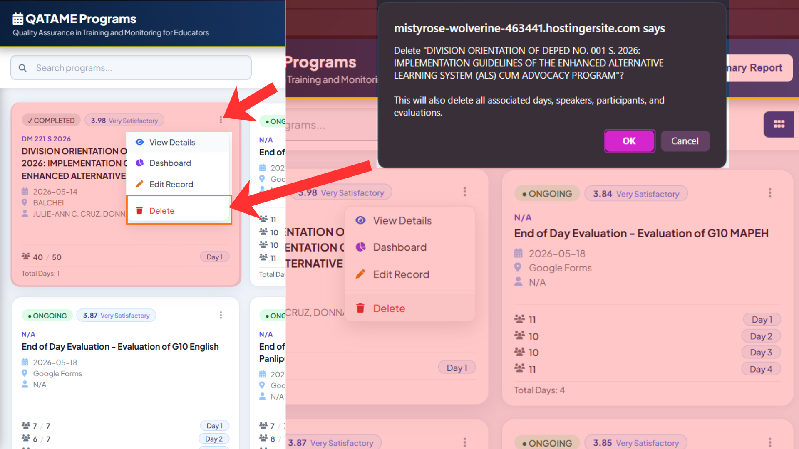

Click the trash icon to delete. A confirmation dialog appears.

For programs with existing evaluation submissions, a second confirmation is required before the data is permanently removed.

For container programs, deletion removes the container and all associated data. Linked imports that were standalone records are not automatically deleted.

## 7. Manage Responses, Reports, and Monitoring

In Programs, open a workshop and use the tabs:
- Overview
- Responses
- Reports
- Monitoring

### Responses tab

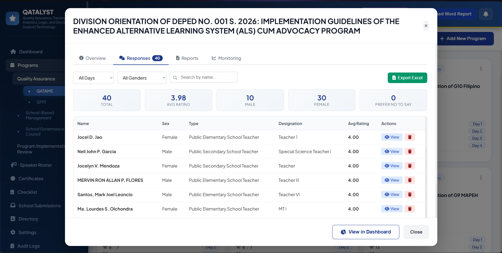

Use it to:
- Filter responses by day (using the day selector), sex, and participant name.
- View individual response details by clicking View on any row.
- Delete a single response.
- Export responses to Excel (multi-sheet: Responses, Category Averages, Question Averages, Speaker Ratings if present, Feedback, and an Export Summary sheet).

The response count badge on the tab reflects the currently visible (filtered) count.

For container programs with no day selected, responses from all linked imports are merged. Selecting a specific day from the selector shows only that import's responses.

Notes:
- For container programs and Excel imports, responses come from the respondents table (keyed by evaluation_programs.id).
- For live-form (system-entry) programs, responses come from evaluation_submissions (keyed by workshop_day_id).

### Reports tab

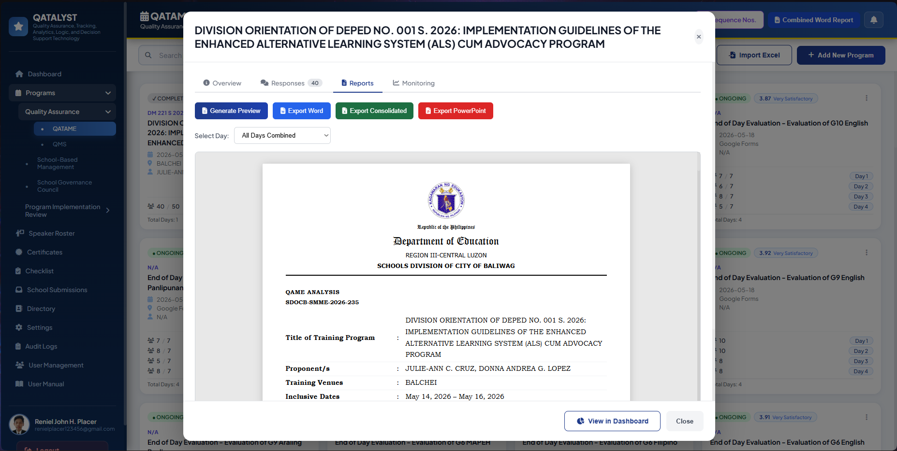

Use it to:
- Select a specific day or All Days Combined from the day selector.
- Click Generate Preview to render the QAME report inline.
- Export Word to download the full QAME report as a formatted .docx file (with DepEd header, category indicator tables, speaker sections, participant feedback, rating scale legends, and signatory block).
- Export Excel to export all response and average data as a multi-sheet workbook.
- Export PowerPoint to generate a presentation with the evaluation dashboard, indicator scores, and participant feedback slides.
- Generate AI Summary to produce an AI-generated summary from participant feedback (requires the AI feature to be configured).

The report reflects the selected day. For All Days Combined, data is aggregated across all linked imports.

### Monitoring tab

Use it to:
- View overall completion statistics: total participants, completed, pending, and completion rate.
- See a day-by-day completion bar for multi-day programs and container programs.
- Filter the participant table by status (attended, partial) and search by name or email.
- Send Remind All Incomplete to email all participants who have not yet submitted (system-entry programs only).

For container programs, the monitoring view aggregates attendance across all linked imports and deduplicates participants by email or name.

For standalone Excel imports and container programs, the completion table shows per-day attendance and highlights which days a participant missed.

## 8. Participant Evaluation Submission Guide

Related page:
- evaluation.html

Participant steps:
1. Open the evaluation link provided by the organizer.
2. Fill in participant information.
3. Select the workshop day being evaluated.
4. Answer all required questions.
5. Click Submit Evaluation.
6. Confirm success message appears.

Important notes:
- The form can include rating, text, and speaker-evaluation questions.
- If the same participant submits again for the same day, the latest submission replaces the previous answers.

## 9. Other Modules

### Certificates
- Select a program/workshop, then manage certificate files and participant distribution.
- Upload certificate files (for example PDF/images) and link them to participants.
- Send certificates by email (bulk send is available when participant name and email are present).
- Track email delivery status (sent vs pending) and review sent timestamps when available.
- Use the splitter tool when a single certificate file needs to be separated into multiple files.

Related pages:
- certificate.html

### Speaker Roster

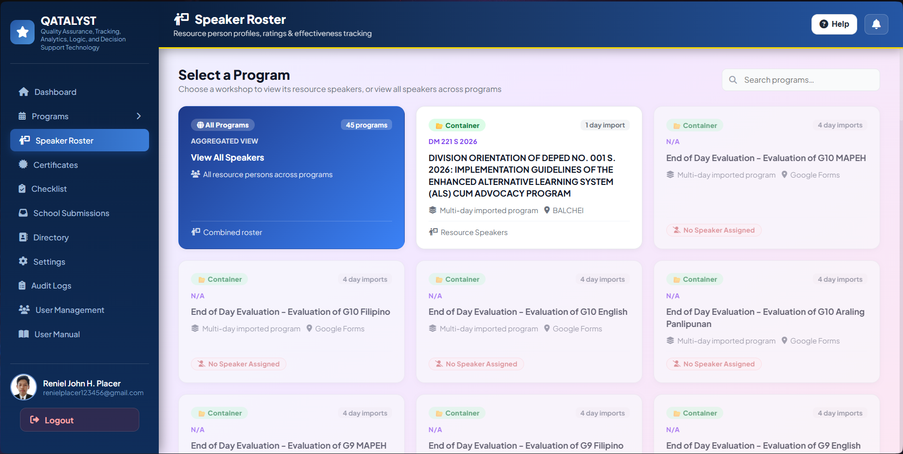

The Speaker Roster page shows all resource speakers aggregated from evaluation data. It opens first with a workshop grid so you can browse speakers by program, or view all speakers at once.

Related page:
- speaker-roster.html

#### Workshop Grid

When the page loads, it shows a card grid of all programs and workshops. Each card displays the program title, status badge, division memo, dates, and participant count. A special **All Speakers** card (in blue) at the top lets you view every speaker across all programs at once.

Use the search bar at the top right to filter programs by title.

Click any card to open the speaker list for that program.

#### Speaker List

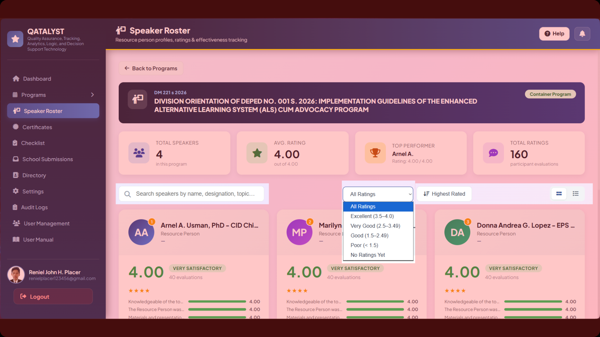

After selecting a program, the speaker list appears with the following controls:

- **Search** — filter speakers by name in real time.
- **Rating filter** — filter by rating band: Excellent (3.5–4.0), Very Good (2.5–3.49), Good (1.5–2.49), Poor (below 1.5), or No Ratings Yet.
- **Sort toggle** — switch between Highest Rated and Lowest Rated order.
- **View toggle** — switch between Card view and Table view.

The **Card view** shows each speaker as a badge card with their name, designation, organization, average rating, rating label, response count, and a rank badge for the top 3 performers.

The **Table view** shows speakers in a sortable table with columns for name, organization, topic, workshop and day, average rating, responses, and an action button.

#### Speaker Detail Modal

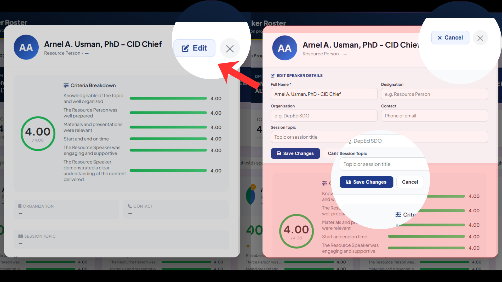

Click any speaker card or table row to open the Speaker Detail modal. The modal shows:

- **Avatar and header** — speaker initials, full name, designation, and organization.
- **Overall rating circle** — the computed average score out of 4.00.
- **Criteria Breakdown** — individual scores for each evaluation criterion (e.g. Mastery of Subject Matter, Delivery, etc.), displayed as a list with labels.
- **Organization, Contact, and Session Topic** — speaker profile fields.
- **Workshop Appearances** — a list of every program and day the speaker appeared in, with the rating for each appearance.

#### Editing a Speaker

Click the **Edit** button in the modal header to open the edit form. You can update:
- Full Name, Designation, Organization, Contact, and Session Topic.

Click **Save Changes** to apply. The modal updates immediately with the new values without needing a page reload. Click **Cancel** to discard changes.

### Checklist

The Checklist module tracks document submission status for private schools across all required application and request categories under DepEd Region III. Each school's progress is tracked per school year.

Related page:
- checklist.html

### QR Generator

The QR Generator page lets staff create QR codes for program links and other evaluation shortcuts.

Related page:
- qr-generator.html

#### School Type Tabs

At the top of the tracker, use the tabs to switch between **Private Schools** and **Public Schools**. Public school tracking is currently under development and not yet available.

#### School Year Bar

Year pills appear below the tabs showing all available school years. Click a year pill to switch the view to that year's data. Each pill also has a delete (×) button to remove the year — deletion is only allowed if the year has no existing tracking records. To add the next school year, click the **+ [next year]** button that appears after the last year pill.

#### School Selector

Use the school selector button (top right of the tracker) to filter the view to a single school or show all schools. A search box inside the dropdown lets you type to find a school quickly.

#### School Cards and Toolbar

The main view shows a grid of school cards. Each card displays the school name, education level badges, completion percentage, steps completed out of total, and a Completed / Ongoing / Pending status badge.

Use the toolbar to manage the view:
- **Search** — type part of a school name to filter the cards in real time.
- **Filter pills** — show All schools, or filter to Completed, Ongoing, or Pending only.
- **View toggle** — switch between grid, list, and compact layouts.

The stats row above the cards shows total schools and counts for Completed, Ongoing, and Pending.

Notes on completion percentage: only three categories count toward a school's completion percentage — School Calendar (all steps), Tuition Fee per level (whichever of Increase or No Increase was submitted for that level), and Renewal of Government Permit. All other categories are tracked but do not affect the percentage.

#### Updating a School's Checklist

1. Click a school card to open its slide-out panel.
2. The panel shows a completion ring, all document categories, and their workflow steps as checkboxes.
3. Check or uncheck steps as documents are processed. When a step is checked, a timestamp badge appears showing when it was marked.
4. Click **Save changes** to save. Click **Cancel** to discard without saving.

#### Editing Timestamps

Each category section in the panel has an **Edit Timestamps** button. Clicking it opens a timestamp editor for that category where you can:
- Set an **exact date and time** for each checked step using a date/time picker.
- Set a **quarter** (Q1–Q4) instead of an exact date when the precise date is unknown.
- Clear a timestamp using the × button.

Click **Apply** to write the timestamps back to the panel. Timestamps are saved to the server when you click **Save changes**.

#### Document Categories Tracked

The tracker covers the following submission types per school:

- School Calendar (steps: Received w/ Compliance, Endorsed to RO, Approved, Released)
- Increase on Tuition Fee — per level: Pre-School, Elementary, Junior HS, Senior HS (steps: Endorsed to RO, Approved, Released)
- No Increase on Tuition Fee — per level: Pre-School, Elementary, Junior HS, Senior HS (steps: Endorsed to RO, Approved, Released)
- Authority to Operate (New) — per level: Pre-Elem, Elem, JHS, SHS (steps: Endorsed to RO, Approved, Released)
- Renewal of Government Permit (steps: Endorsed to RO, Approved, Released)
- Application for Government Recognition — levels: Pre-Elem, Elem, JHS
- Application for Tracks/Strand (steps: Endorsed to SDS, Approved, Released)
- Application for Special Programs (steps: Endorsed to RO, Approved, Released)
- Request for Off-Campus Activities (step: Received & Acknowledged)
- School Campaign (steps: Endorsed to RO, Approved, Released)
- Closure (steps: Endorsed to RO, Approved, Released)
- Special Order (SHS) (steps: Endorsed to RO, Approved, Released)

#### Generate Indorsement (from the header)

Click **Generate Indorsement** at the top of the tracker to open the indorsement letter generator.

How to use it:
1. Select the indorsement type: School Calendar, Tuition Fee Increase, No Increase, or School Permit.
2. Search for and select a school from the dropdown, or type the school name and address manually.
3. Select the school year.
4. Choose the indorsement number (1st through 6th). The 1st Indorsement goes to the Regional Office; the 3rd returns to the school as Approved.
5. For School Calendar submissions, optionally enter the total school days, start date, and end date.
6. For No Increase and School Permit submissions, select the applicable education level(s).
7. Set the letter date and confirm the signatory name and position. Use **Change Signatory Name** to search and select from the personnel directory.
8. Review the live letter preview. You can edit the preview text directly if adjustments are needed.
9. Click **Save & Update Tracker** to save the indorsement record and automatically check the corresponding tracker step (Endorsed to RO for 1st Indorsement; Approved for 3rd Indorsement).
10. Click **Download .docx** to download the formatted indorsement letter as a Word document.

Notes:
- Saving a 1st Indorsement automatically checks **Endorsed to RO** in the tracker for that school.
- Saving a 3rd Indorsement automatically checks **Approved**.
- If the school year does not exist in the tracker yet, it is created automatically.

#### Generate Indorsement (from a school card)

Each school card has a **⋮** (actions) menu. Clicking it opens a small menu where you can:
- Select the indorsement type for that school (School Calendar, Tuition Fee Increase, No Increase, or School Permit). This preference is saved per school.
- Click **Open Form** to open the full indorsement generator pre-filled with the school's name, address, school year, and education levels.
- Click **Download** to generate and immediately download the indorsement letter as a .docx without opening the form.

#### Other Actions

- **Manage Schools** — opens the Directory page where school records can be managed.

---

### School Submissions (All Documents Submitted)
- Review all school-submitted documents across types.
- Filter by type and status, then open a record to view details.
- Update document status and add remarks.
- Preview files, print calendar previews, and download documents (including calendar DOCX when supported).

Common statuses include:
- Pending Review
- Approved
- Returned for Correction
- For Endorsement
- Released to School

Related page:
- documents-submitted-all.html

### School Portal Pages

The school portal includes separate pages for registration, verification, announcements, dashboard activity, calendar and tuition submissions, profile management, and portal-facing documentation.

Related pages:
- school-portal.html
- school-portal-verify.html
- school-portal-dashboard.html
- school-portal-calendar.html
- school-portal-calendar-submitted.html
- school-portal-tuition.html
- school-portal-tuition-submitted.html
- school-portal-announcements.html
- school-portal-audit.html
- school-portal-permit.html
- school-portal-profile.html
- school-portal-submissions.html
- school-portal-tracker.html
- school-portal-user-manual.html

---

### Audit Logs
- Search by action, module, role, status, or date range.
- Filter by school to review specific activity.
- Export audit logs to CSV for external review.

Related page:
- audit-logs.html

### Import Excel
- Upload participant/response spreadsheets and use the Column Mapper to map fields.
- Save and reuse column configurations for repeatable imports.
- Auto-matching can apply a saved configuration if your new file has similar columns.
- Watch for warnings about new/changed columns and adjust mappings as needed.

If you entered Import Excel through Add Day Import from a container program:
- The import is linked to the selected program and saved under the provided day label (Day 1, Day 2, etc.).
- The importer will normalize day labels automatically; you do not need to rename your Excel sheet tabs.

Related page:
- import-excell.html

### Workshop Dashboard

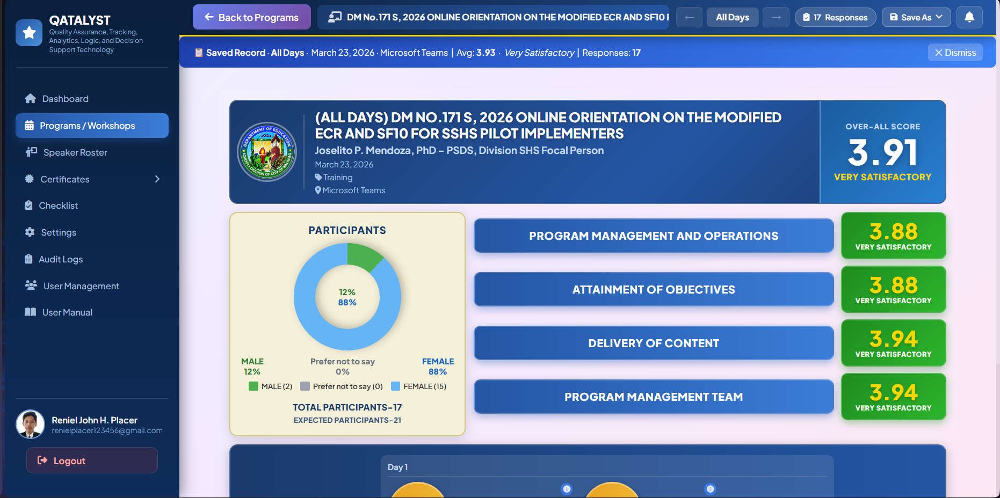

The Workshop Dashboard displays a visual summary of evaluation results for a specific program or workshop. It is opened automatically when you click the Dashboard button from the Programs list.

Related page:
- workshop-dashboard.html

#### Header

The header card shows the program title, proponents, division memo, date, nature of event, and venue. An **Over-All Score** box on the right displays the computed average across all indicators and its descriptive equivalent (for example, Very Satisfactory).

#### Day Navigation

Use the **← →** arrow buttons in the page header to move between days. The current day label (for example, Day 1, Day 2, or All Days) is shown between the arrows. When a multi-day program is loaded, the dashboard defaults to All Days view, aggregating data across all linked imports.

#### Response Count

The **Responses** pill in the header shows the total number of evaluation responses for the currently selected day. The same count appears in the Responses badge at the bottom of the Resource Speakers row.

#### Participants Panel

The left panel shows a donut pie chart breaking down participants by sex: Male, Female, and Prefer not to say. Each segment shows a percentage. The total participant count is shown below the chart. If sex data was not collected, the pie chart is hidden and only the total is shown. Clicking the pie chart opens a Participants Detail modal with exact counts, percentages, and a response rate if an expected participant count was set.

#### Indicators Panel

The right panel lists evaluation category scores as indicator rows. Each row shows the category name, its average score, and a descriptive label. Scores are color-coded: green for high, blue for moderate, yellow for low, and red for very low. Clicking an indicator row opens a Category Detail modal showing all questions under that category, ranked by score, with highest and lowest areas highlighted.

#### Resource Speakers Row

The bottom of the dashboard lists resource speakers as badge cards. Each badge can show the speaker's rank (RP 1, RP 2, etc.), rating score, name, and a highlight for the top-rated speaker. Clicking a speaker badge opens a Speaker Detail modal showing per-criteria scores, strengths, and areas for improvement.

#### Speaker Display Settings

Click the gear icon (⚙) in the Resource Speakers row title to open the Speaker Display Settings modal. You can toggle the following on or off:
- Show Speaker Names
- Show Ratings
- Show Rank
- Show Badge Label (RP 1, RP 2 labels)
- Highlight Top Speaker
- Show Response Count

Settings are saved to the server and applied immediately.

#### Save As (Export)

Click the **Save As** button in the page header to export the dashboard as an image:
- **PNG** — saves the dashboard board as a high-resolution PNG file.
- **JPEG** — saves it as a high-quality JPEG file.

The exported file is named using the program title and date. Both formats capture the full dashboard at a fixed wide width for consistent output.

### Activity Summary Report

The Activity Summary Report is a standalone page that gives an overview of all programs and workshops across quarters.

Related page:
- program-summary.html

#### Opening the report

From any program page (QATAME, QMS, SBM, etc.), use the Activity Summary button to open the report. The Back to Programs button at the top returns you to the page you came from.

#### Filter by Quarter

Use the Filter by Quarter selector at the top to narrow the view:
- 1st–4th Quarter (Overall) — shows all programs across the year.
- 1st Quarter / 2nd Quarter / 3rd Quarter / 4th Quarter — shows only programs whose start date falls in that quarter.

Quarter assignment is based on the program's start date month. Programs without a recognizable date are excluded from quarterly filtering.

#### KPI Cards

Four summary cards appear at the top:
- Total programs — count of programs in the selected filter.
- Completed — count of programs with Completed status, plus the completion rate as a percentage.
- Ongoing — count of programs currently marked Ongoing.
- Top division — the functional division (Unit) with the most programs, along with its count and share.

#### Charts

Four charts visualize the filtered data:
- Programs by quarter — bar chart showing how many programs fall in each quarter.
- Nature of event — donut chart breaking down programs by their nature of event type.
- By functional division — horizontal bar chart ranking divisions by program count.
- Status breakdown — donut chart showing Ongoing, Upcoming, Completed, Cancelled, and other statuses.

#### Program list tables

Below the charts, programs are listed in tables grouped by quarter. Each row shows: number, Issuance/Report No. (sequence number and/or division memo), Name of Event/Activity, Inclusive Dates, Venue, Functional Division, and Nature of Event.

When the Overall filter is selected, four separate quarter tables are shown. When a single quarter is selected, one table is shown for that quarter.

#### Search

A search bar above the program tables lets you filter rows in real time by title, DM number, date, venue, unit, or nature of event. A clear (×) button appears when text is entered. Searching filters the visible rows without changing the KPI cards or charts.

#### Export Word

Click Export Word to download the summary as a formatted .docx file. The export includes:
- A title block with report title, quarter line, and generation date.
- A Summary section with total program count.
- A Programs / Workshops section with the same tables shown on screen (all four quarters when Overall is selected, or just the selected quarter).
- A Statistical Breakdown section with count tables for: By Quarter, By Source, By Status, By Functional Division, and By Nature of Event.

The export uses the snapshot from the most recently rendered view. If you change the quarter filter, the export reflects the updated filter immediately.

### Schools Submissions Summary

The Schools Submissions Summary provides a cross-school, cross-category view of submission progress for private schools in the division. It shows how many documents each school has had endorsed, approved, and released — broken down by quarter — and supports filtering, searching, and multi-format export.

Related page:
- schools-submissions-summary.html

#### What the Summary Tracks

The summary tracks the following submission categories per school:

- School Calendar
- Increase on Tuition Fee (Pre-School, Elementary, Junior HS, Senior HS)
- No Increase on Tuition Fee (Pre-School, Elementary, Junior HS, Senior HS)
- Authority to Operate (New)
- Renewal of Government Permit
- Application for Government Recognition
- Application for Tracks/Strand
- Application for Special Programs
- Request for Off-Campus Activities
- School Campaign
- Closure
- Special Order (SHS) and Level

Each category tracks workflow steps (Endorsed, Approved, Released) where applicable. Some categories — Authority to Operate, Government Recognition, Special Order Level, and Off-Campus — are shown in a separate **Level Submissions** table rather than the quarterly counts table.

#### Filters and Search

At the top of the page, use the controls to narrow the view:

- **School Year** — select the school year to load. Available years are loaded from the database; if none are found, the current school year is shown by default.
- **School Type** — currently supports Private schools. Public school tracking is under development.
- **Category** — filter the quarterly counts table to show data for a single submission category, or leave on All to show combined totals.
- **Status** — filter schools by completion status: All, Done (100%), Partial (1–99%), or Pending (0%).
- **Search** — type part of a school name to filter the table in real time.

#### Summary Statistics

Above the table, summary widgets show:
- Total schools in the filtered view.
- Number of schools Done, Partial, and Pending.
- Average completion percentage across all filtered schools.

Completion percentage is calculated from three required categories: School Calendar (all steps), Tuition Fee per level (whichever of Increase or No Increase was submitted for that level), and Renewal of Government Permit.

#### Quarterly Counts Table

The main table lists each private school with columns for Q1 (Jan–Mar), Q2 (Apr–Jun), Q3 (Jul–Sep), and Q4 (Oct–Dec). Within each quarter, three sub-columns show the number of submissions that reached Endorsed, Approved, and Released status during that period. A dash (—) is shown when the count is zero.

#### Level Submissions Table

Below the quarterly table, a separate Level Submissions table shows Authority to Operate, Application for Government Recognition, Off-Campus Activities, and Special Order Level, with a checkmark (✓) or quarter badge per school per level.

#### Category Bars

A category breakdown section shows bar charts with submission progress per category across all schools.

#### Export Options

Click **Export** to open the export modal. The following export types are available:

- **School List** — exports one row per school with overall totals and per-quarter (Endorsed / Approved / Released) counts. Respects the current school year, school type, category, and search filters.
- **Quarterly Counts** — exports category-level quarterly counts for a selected quarter range (Q1–Q4, individually or combined). This export shows totals aggregated across all schools.
- **Word Report** — exports the summary as a formatted Word document for reporting purposes.
- **Category Filter Export** — lets you build a custom filter to find schools that have or have not submitted specific categories, then export the matching school list. You can add multiple filter rows, choose AND (school must match all filters) or OR (school must match any filter), and see a live preview of how many schools match before exporting.

---

### Directory
- View directory records and contact-oriented listings.
- Filter by division/district and use search to find personnel or school entries.
- Review updates coming from portal users (when applicable).

Related page:
- directory.html

### User Management (admins)
- Manage SDO user accounts and (if enabled) portal user accounts.
- Assign roles and permissions (available roles may be loaded from the database).
- Use filters to find users quickly and maintain access based on actual duties.

Related page:
- user-management.html

### Settings
- Update profile/security preferences (for example, profile picture and password).
- Manage account-related settings such as two-factor authentication (if enabled).

Related page:
- main-settings.html

### User Manual
- Use Full Manual for all sections you can access.
- Use focused Help buttons to view the current page guide only.

Related page:
- user-manual.html

## 10. Security and Account Tips

- Use a strong password and keep it private.
- Enable two-factor authentication when available.
- Always sign out, especially on shared devices.
- If you cannot sign in, use Forgot Password.

## 11. Quick Troubleshooting

1. I cannot access a page:
   - You may not have the required permission. Contact an admin.
2. Notifications are not updating:
   - Refresh the page and ensure your session is still active.
3. I submitted an evaluation but cannot see it:
   - Check the correct workshop and day filters in Programs > Responses.
4. Export buttons do not work:
   - Check your permission and try again after page refresh.
5. Login keeps failing:
   - Verify credentials, check email for 2FA code, or use reset-password flow.

## 12. Reference Documents

For technical setup and API details, see:
- README.md
- DOCUMENTATION.md

For school-facing workflows (school account registration, verification, school submissions, and school calendar builder), see:
- school-portal-user-manual.html
